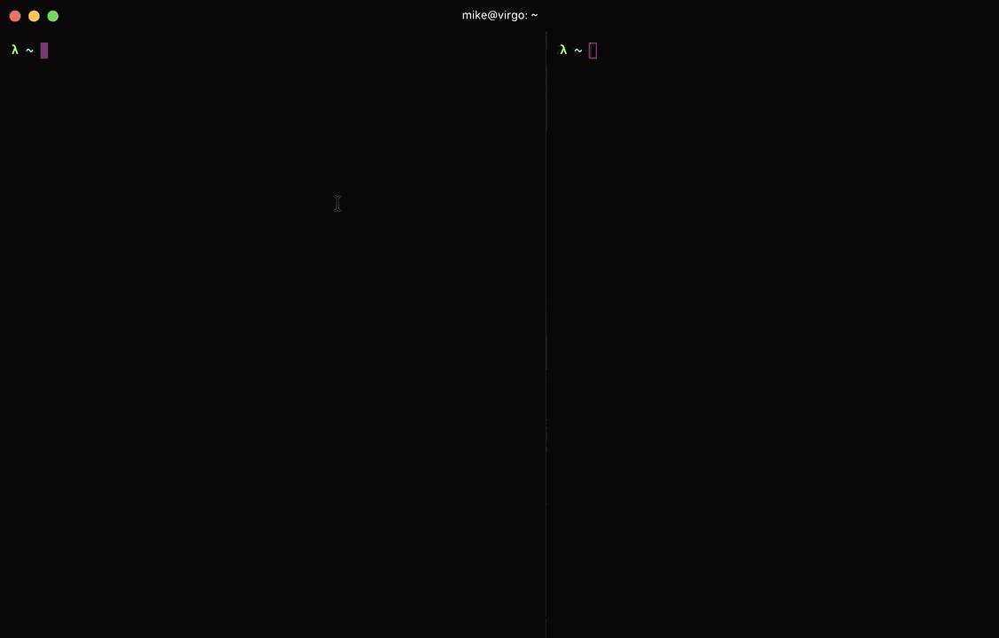

dump-http
=========

[![build status][travis-badge]][travis]

`dump-http` is an HTTP dump server. It could be useful for testing purposes (e.g.: testing third-party modules/libs/components HTTP behaviuor).

Basically, on every HTTP requests `dump-http` will:

- Respond with the **raw HTTP request** in plain text format
- Pretty print **request line**, **raw headers** and **raw body** on console

<p align="center">
  
</p>

### Install

```bash
npm install -g ParosSrl/dump-http
```

### Usage

##### CLI

```bash
# Start a dump-http server on port 8080

dump-http --port 8080
```

##### Programmatic

```bash
const dump = require('dump-http')

dump().listen(3000, '0.0.0.0', () => console.log('Dump server is listening in port 0.0.0.0:3000'))
```

### Test

```bash
npm test
```

### Coverage

```bash
npm run coverage
```

### License

Copyright 2017 Paros s.r.l.

Permission is hereby granted, free of charge, to any person obtaining a copy of this software and associated documentation files (the "Software"), to deal in the Software without restriction, including without limitation the rights to use, copy, modify, merge, publish, distribute, sublicense, and/or sell copies of the Software, and to permit persons to whom the Software is furnished to do so, subject to the following conditions:

The above copyright notice and this permission notice shall be included in all copies or substantial portions of the Software.

THE SOFTWARE IS PROVIDED "AS IS", WITHOUT WARRANTY OF ANY KIND, EXPRESS OR IMPLIED, INCLUDING BUT NOT LIMITED TO THE WARRANTIES OF MERCHANTABILITY, FITNESS FOR A PARTICULAR PURPOSE AND NONINFRINGEMENT. IN NO EVENT SHALL THE AUTHORS OR COPYRIGHT HOLDERS BE LIABLE FOR ANY CLAIM, DAMAGES OR OTHER LIABILITY, WHETHER IN AN ACTION OF CONTRACT, TORT OR OTHERWISE, ARISING FROM, OUT OF OR IN CONNECTION WITH THE SOFTWARE OR THE USE OR OTHER DEALINGS IN THE SOFTWARE.

[travis-badge]: https://img.shields.io/travis/ParosSrl/dump-http.svg
